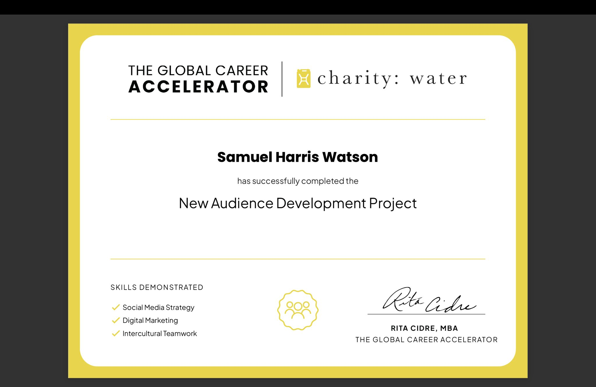

# Charity: Water Audience Development Strategy

Data-driven audience segmentation and growth strategy for a global nonprofit organization

---

## Overview

Developed a data-driven audience expansion strategy by analyzing demographic segmentation, engagement patterns, and digital behavior to identify high-growth target audiences.

---

## Objective

Identify and prioritize audience segments with the highest potential for engagement and donor conversion.

---

## Data

* Demographic segmentation data
* Engagement metrics across digital channels
* Behavioral trends across target audiences

---

## Methodology

* Segmented audiences based on demographic and behavioral characteristics
* Analyzed engagement patterns across channels
* Identified high-growth segments with strong conversion potential
* Developed scalable marketing frameworks for outreach optimization

---

## Results

* Identified high-value audience segments with strong engagement potential
* Uncovered patterns in digital behavior across intercultural markets
* Developed scalable strategies to improve donor acquisition and retention

---

## Key Takeaway

Targeted audience segmentation combined with data-driven outreach strategies can significantly improve engagement and donor conversion in global nonprofit markets.

---

## Tools

Excel (Segmentation, Analysis)
Data Visualization
Marketing Strategy Frameworks

---

## Visualization  

